# led-strip-szbox-s1
***English***
| [Русский](README.ru.md)
___
Solving the problem with the non-working LED strip on the mini PC SZBOX S1 (ACEMAGIC S1)
___
## 1. Background
When choosing a server for PROXMOX, the mini PC **SZBOX S1 Intel Alder Lake N97** (copy of **ACEMAGIC S1**) on Aliexpress was selected.

  

    
    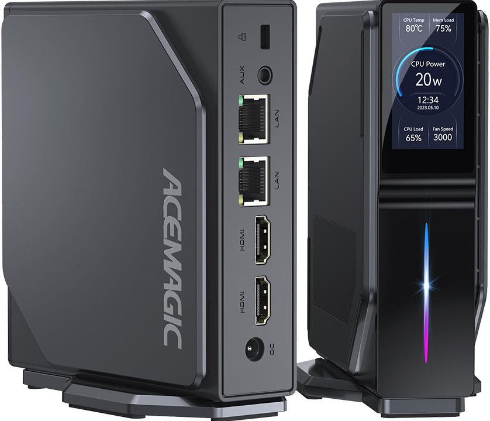
     
    <em>SZBOX S1 and ACEMAGIC S1</em>
  

 

The PC easily supports a memory capacity of up to 32GB, despite the fact that the description indicated only a maximum of 16GB.\
Also, the presence of an information display made this PC simply indispensable for a home server.

Thanks to the project [AceMagic-S1-LED-TFT-Linux](https://github.com/tjaworski/AceMagic-S1-LED-TFT-Linux) (many thanks to the author!) the display and LED bottom backlight worked in Linux without problems.\
But, unfortunately, after a few months a malfunction appeared - the LED backlight stopped working.

___
## 2. Can it be repaired?
An idea arose to fix the broken LED backlight.\
The housing was disassembled and the LED module was removed to check it.\
The module contains 6 addressable RGB LEDs, and passive elements in the form of a resistor and several capacitors.\
In fact, the module does not contain control elements, it is simply a set of addressable RGB LEDs.

  

    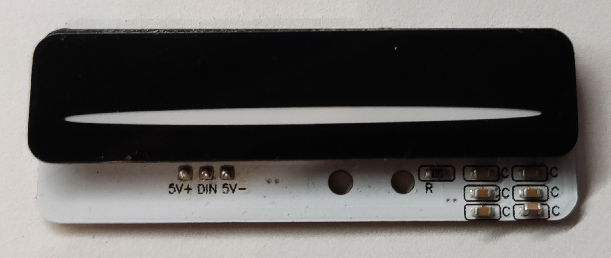
     
    <em>LED module</em>
  

  

    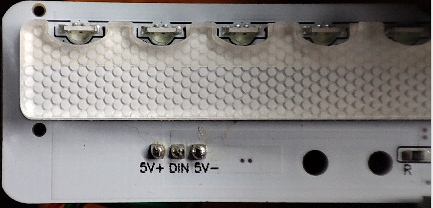
     
    <em>LED module without top cover</em>
  

  

    
     
    <em>LED module and TFT screen on the back side</em>
  

 

It turned out that it is connected to the main board through a connector that can be disconnected and the module removed completely.\
The module was connected to another mini PC - and the backlight module turned out to be working.

There was an attempt to analyze the LED module control circuit.\
The module is powered by +5V and has one control pin.

It turned out that the control pin is connected to a chip that is not marked
(except for the letter B, where the key is on the body of the 1st pin).\
The chip is located on the board near the power button, under the radiator and has the number **U31**:

  

    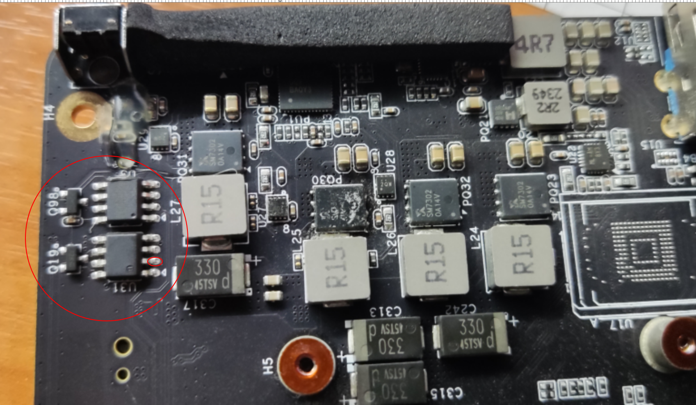
     
    <em>On the left is the LED module control chip and the UART chip</em>
  

  

    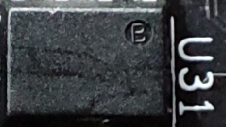
     
    <em>Unknown chip U31</em>
  

 

The chip pin **U31-2** is connected to the module pin **LED-DIN**.\
Nearby is the **U3** - **CH340N** - **USB to UART TTL Converter** chip.

The connection diagram that managed to draw with the signals on the working chip:

  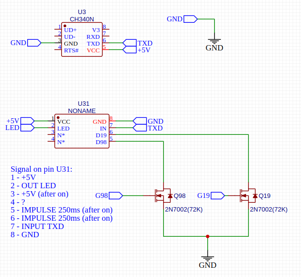

On the faulty chip **U31** there are no signals at the following pins:\
**2, 3, 5, 6**.

It turned out that this chip is either a microcontroller or a special chip that performs the following functions:
* when the power is turned on - it generates a signal at pin 2, and the LED backlight starts working according to the primary algorithm, even if there are no disks or memory in the PC.
* the chip can be specified in the LED operating mode by sending a command via UART of a certain type, which it receives on pin 7, which is connected to the **U3-6(TXD)** chip.

The assignment of MOSFET **Q19** and **Q98** could not be determined.\
One thing is clear - transistors are not needed for RGB LEDs - they do not consume so much current to be switched through these MOSFET switches.

At all terminals with a multimeter in diode testing mode, the same voltage drop is observed, as at a working **U3**.\
The 3rd conclusion raises the question: is it an output or an input? It was not possible to find where it is connected on the board.
\It is possible that the presence of +5 V on it turns on the chip.

Unfortunately, the search for chips using the specified connections was unsuccessful.

___
## 3. What to do?
Since it was not possible to find a circuit diagram on a mini PC, the question arose - is it possible to restore the operation of the LED module in another way?\
There is a simple Arduino compatible module with **Attiny85** called **Digispark**.\
With USB-micro connector:

  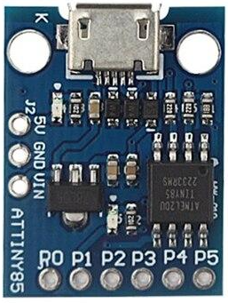

These modules come in several types:

  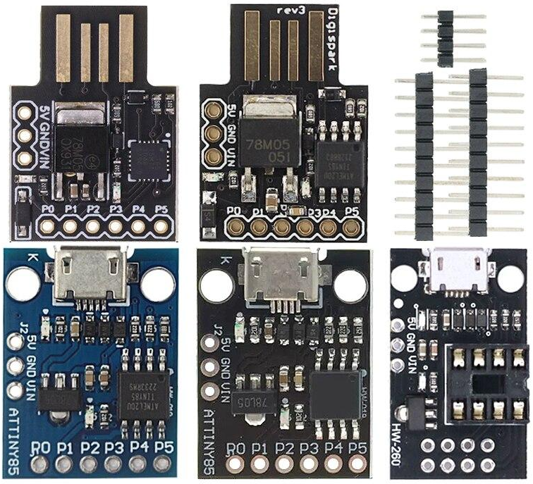

 

The LED module was connected to **Digispark**, and, using **Adafruit's NeoPixel** library, the module worked!

  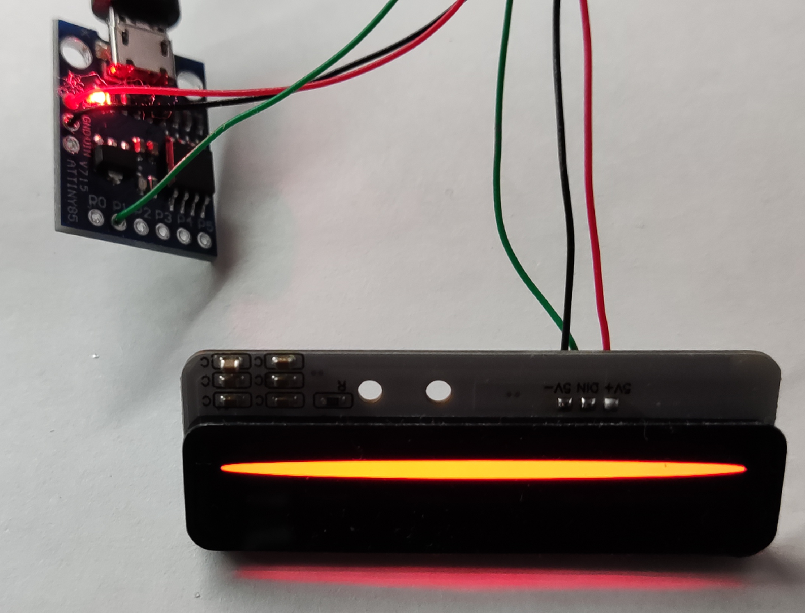
  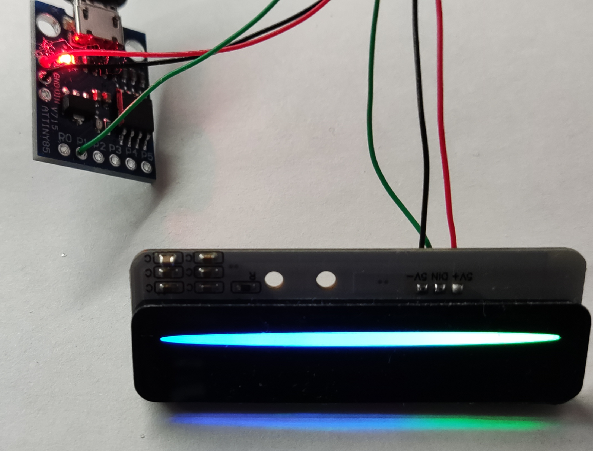
</dev>

___
## 4. Scheme

> :warning: **DISCLAIMER**\
All information and program files provided below are for informational purposes only and are provided without any warranties. Modifications or tampering with your device may void your warranty, permanent equipment damage, or personal injury. The author is not responsible for any damage to your hardware, programs, property or health. You act at your own risk. All proposed improvements are provided for review purposes and are not required to be repeated. Always follow safety precautions when working with electronics and ensure that your operations comply with local laws and safety standards.
___

The **Digispark** board has the following pins:

  

 

Power from the PC board is connected via the standard connector **JST SH 3pin**.\
+5V is connected to the 5V pin via a diode (red wire in the diagram below), the common pin is connected to the GND pin (black wire in the diagram below).\
In the Arduino sketch described [further](#5-arduino-sketch), the code refers to the names of the pins - `PB0`, `PB1`, etc.\
In fact, only pins `PB0 PB1 PB2` ​​can be used in **Digispark**.\
The `PB1` pin, in this case, is connected to the LED on the **Digispark** board, so it was decided to use it as a pin to control the LED module - the activity of the commands being sent is visible.The `PB2` pin is used to read data from the UART, the `PB0` pin can be used to send debugging data to the UART.

### Variant 1
The simplest improvement variant.

Diagram and description

 
  No intervention is required in the PC electronics; there is no need to disassemble the mini PC - just remove the side cover with magnets.
 
 

> :exclamation:
For the LED module to work, it does not need to be connected to the UART. By default, the program code is configured to cycle through all RGB effects one by one and does not need additional commands sent from the UART to work. Any mode can be selected in the sketch and will be repeated endlessly. Therefore, the connection to pins `PB0` and `PB2` can be omitted and soldering on the mini PC board can be avoided.

  

    

      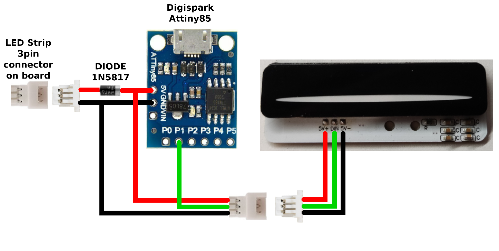
       
      <em>Connection diagram variant 1</em>
    

  

   

  The **Digispark** module is connected between the LED module and the PC board. For this, connectors **JST-SH 3pin 1mm (male | female)** are used.
  

    

      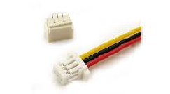
       
      <em>JST SH 3PIN connector</em>
    

    

      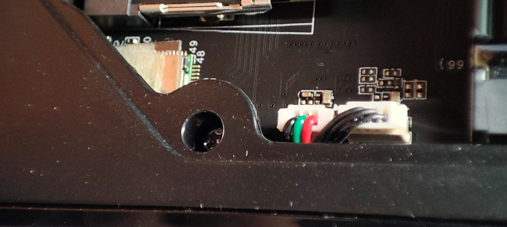
       
      <em>LED module connection connector (left)</em>
    

  

   

  In the three pin connector that comes from the **Digispark** and connects to the PC board, the middle pin needs to be removed. It is also necessary to add a Schottky diode, with a minimal voltage drop across it, to the power wire break if you plan to subsequently connect the **Digispark** module to a PC with Arduino for its firmware.This is protection against voltage supply to a mini PC through the **Digispark** module.

### Variant 2
This variant is more complicated.

  
Diagram and description

   
    It is necessary to disassemble the mini PC, remove the heatsink, and solder to one contact of the UART chip.
   
   

> :exclamation: **Explanation on working with UART:**\
Connection to **UART** is necessary so that you can programmatically set the desired operating mode of the LED module.(See [AceMagic-S1-LED-TFT-Linux](https://github.com/tjaworski/AceMagic-S1-LED-TFT-Linux)). The `PB2` **Digispark** pin is used for this.

  

  

    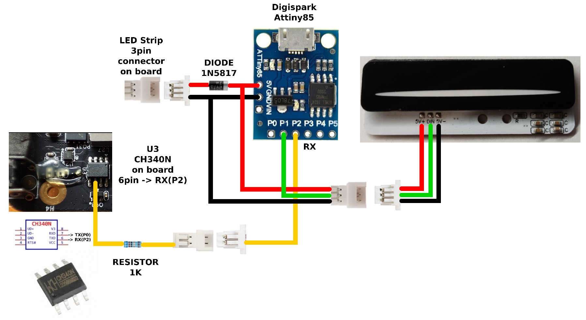
     
    <em>Connection diagram variant 2</em>
  

  

  The connection to **U3** with a resistor looks like this:

  

    

      
    

    

      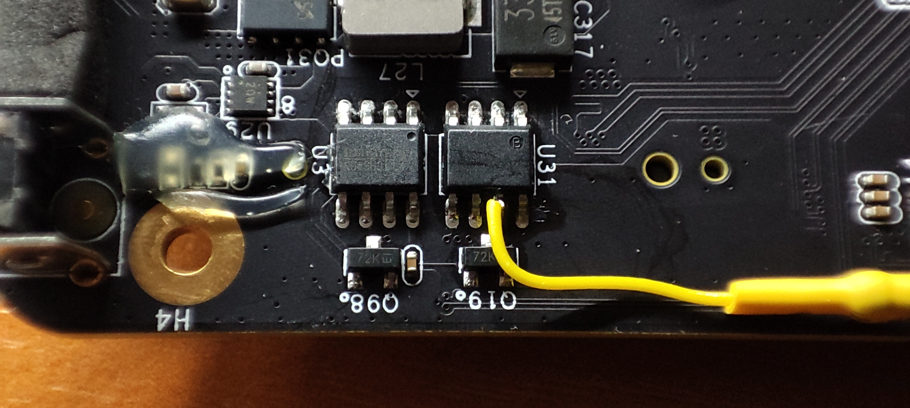
    

    

      
    

  

   

  > :exclamation:
  > The image shows that the resistor wire is connected to **U31**, not **U3**. This was done simply for convenience, since the **U31-7** pin is physically connected to the **U3-6(TXD)** pin.

  Resistors on contacts `PB0` and `PB2` are needed to limit the current in case of a conflict between the signals on the **U3** chip and the **Digispark** module.

  The connection to **U3**, which is **CH340N - USB to UART TTL Converter** is made by soldering a wire to pin **6** of the chip on the mini PC board.

  

    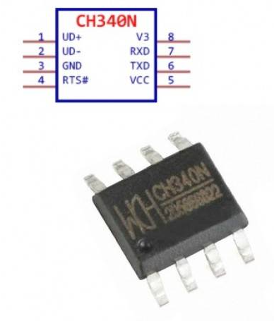
  

   

  This chip is connected to the USB port on the board.\
  It is defined as a device **ID 1a86:7523 CH340 serial converter** and is used to programmatically set the LED panel modes.

  If soldering on the mini PC board is to be avoided, but really want to control the effects, an external +5V USB-UART module can be used. It connects to any USB port, with a single wire running from the **TXD** pin to the **Digispark**.

  For example this or similar:
  

    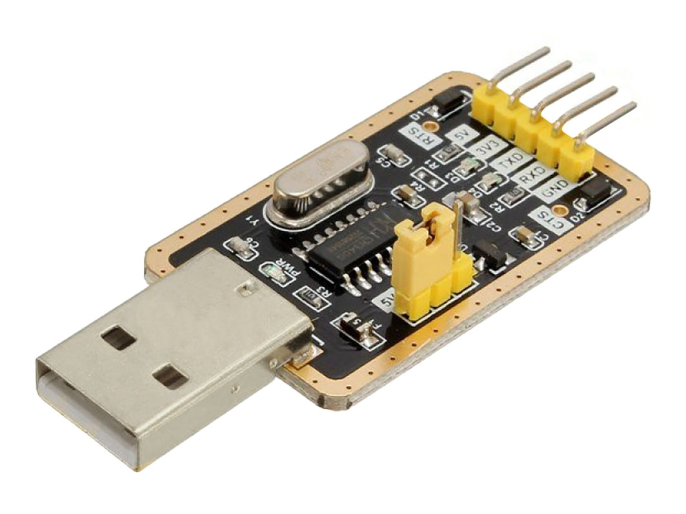
    

   

### Variant 3
This variant is used to debug the **Digisdpark** module.

  
Diagram and description

   

  

    

      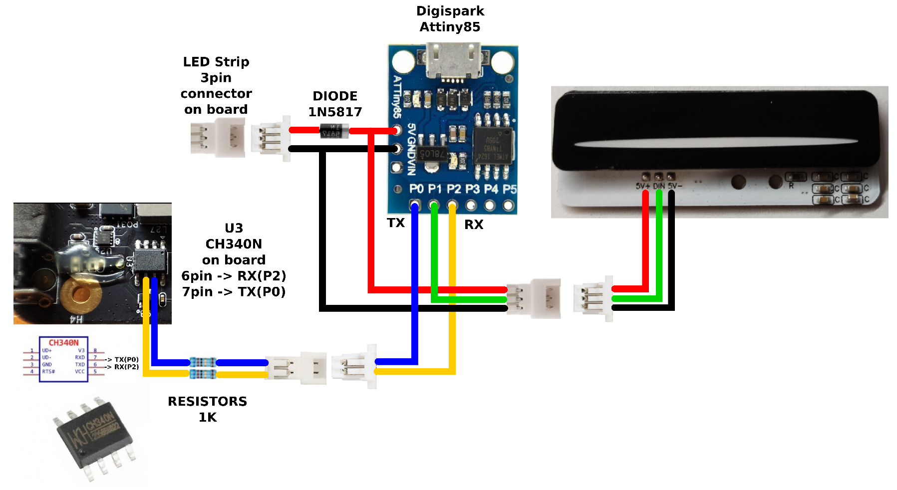
       
      <em>Connection diagram variant 3</em>
    

  

   

  To read debug information from the **Digispark** module, another wire with a resistor must be soldered to the UART chip.

  The `PB0` pin is used for debugging the sketch - outputting debugging information, and is not involved in setting the operating modes of the LED module.

   

  

    

      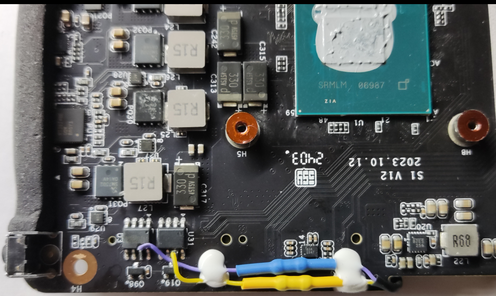
       
    <em>Connection to <b>U3</b> with two resistors</em>
    

     
    

      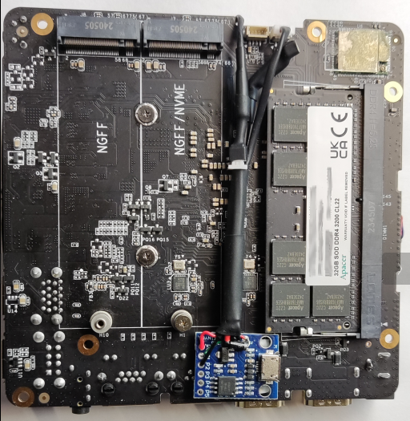
       
    <em>General view of the connected module <b>Digispark</b></em>
    

     
    

      
       
      <em>Connected Digispark module in heat shrink<b>Digispark</b></em>
    

  

   

___
## 5. ARDUINO sketch
Arduino IDE is used for **Digispark** firmware.\
To configure **Arduino IDE** use [ATTinyCore](https://github.com/felias-fogg/ATTinyCore/blob/classic-debug-enabled/Installation.md).

**Digispark** parameter settings:

  

    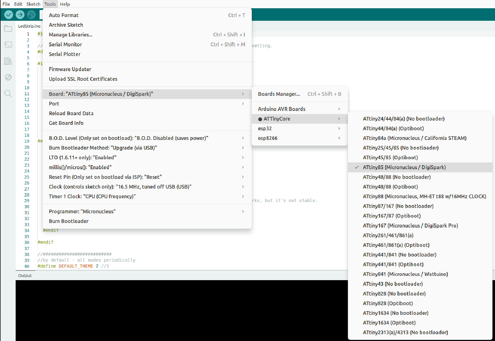
     
    <em>Digispark choice</em>
  

   
  

    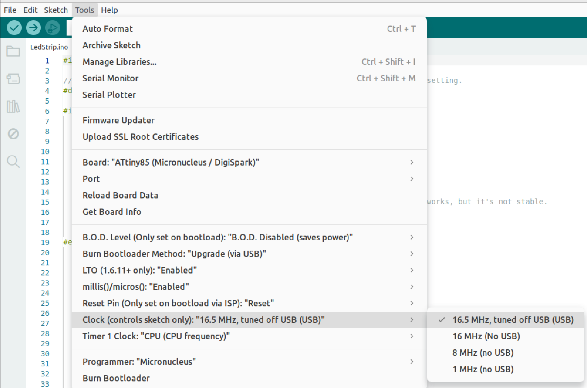
     
    <em>Setting the CPU frequency</em>
  

   
  

    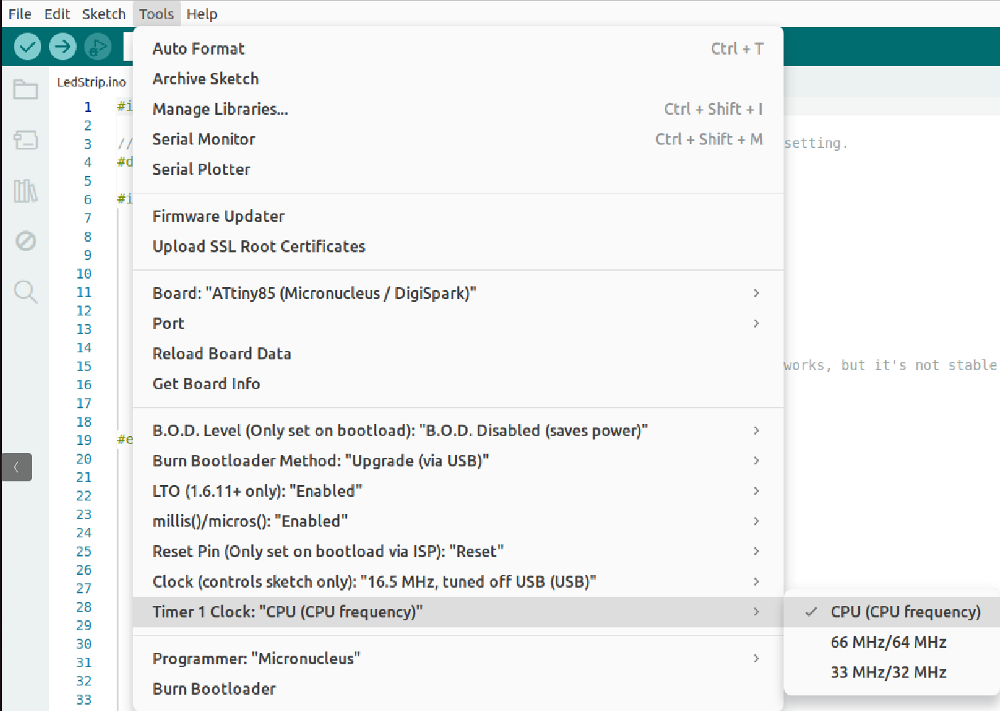
     
    <em>Setting the timer</em>
  

 

You also need to add the **Adafruit Neopixel** library:

  

    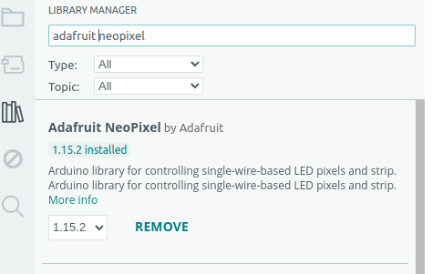
     
    <em>Adafruit Neopixel Library</em>
  

   

The **Digispark** bootloader works on a different principle than, for example, the **Arduino UNO** board.\
When power is applied to the **Digispark** board, it immediately goes into bootloader mode and waits for the sketch to load for 60 seconds.\
This will be indicated in the **Arduino IDE** Output window before flashing the firmware.\
After loading, if there was one, or after a timeout of 60 seconds, the sketch itself starts working.\
Therefore, turning on the LED backlight after turning on the mini PC will occur with a slight delay.

The sketch contains a detailed description of its work.\
An attempt was made to implement the factory LED backlight modes, and several additional ones were added.

The speed of operation with **UART** was selected as `4800` as the most stable.The board can also work on `9600`, but it does not always recognize commands 100%.\
By the way, the original **UART** LED backlight at a speed of `9600` also does not work stably.\
The speed of operation with **UART** can be changed (_SERIAL_SPEED_).

The code also provides for working with the **Arduino UNO** board and +5V strip **WS2812B** of 6 LEDs, for debugging and checking operating modes.\
In this case, the standard Serial object is used as **UART**.

As already mentioned [above](#variant-1) - the **Digispark** module can work with LED backlighting without **UART**. By default, when turned on, it will cycle through all programmed effects.

___
## 6. Summary
As a result of the modernization, the LED backlight works again:

  

    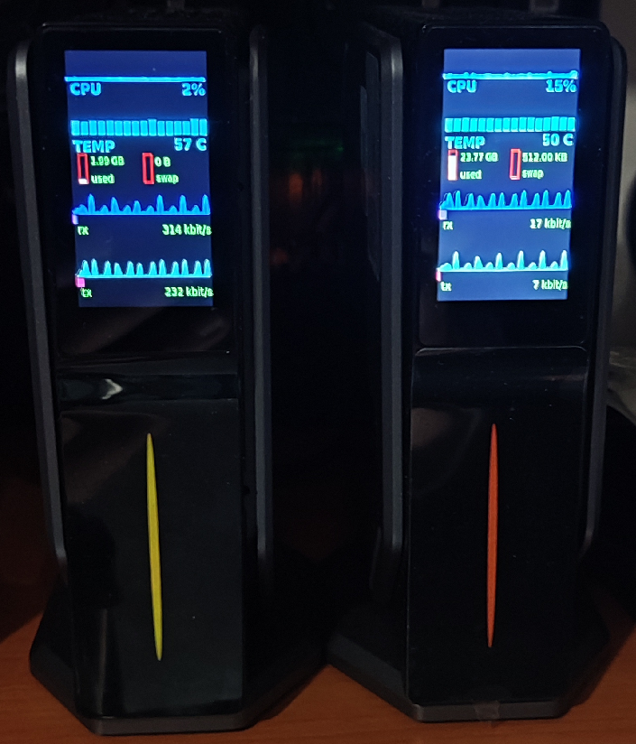
     
    <em>LED backlight (left) works again</em>
  

 

There may be another solution to the problem with the operation of the LED backlight.\
There is always the opportunity to return it “as it was” - by disabling the **Digispark** module.\
One of the advantages is that you can add any RGB effect yourself.